# Fall Detection System using Deep Learning and Kalman Filters

This project implements a fall detection system using deep learning techniques and Kalman filters to process signals from the Sysfall dataset. The system aims to accurately detect falls, enhancing safety and improving response times.

## Repository Structure

- `/`: Jupyter notebooks containing the implementation.
- `figs/`: Directory containing the figures generated during the project.

## Installation

1. Clone the repository:
    ```bash
    git clone https://github.com/Ilia-Abolhasani/fall-detection-kalman.git
    cd fall-detection-kalman
    ```
2. Install the required packages:
    ```bash
        pip install python-bidi
        pip install arabic-reshaper
        pip install scipy
    ```

## Project Overview

### Signal Processing

#### Accelerometer Signals:
<div style="display: flex; justify-content: space-around;">
  <div style="text-align: center;">
    <p>Before Kalman Filter:</p>
    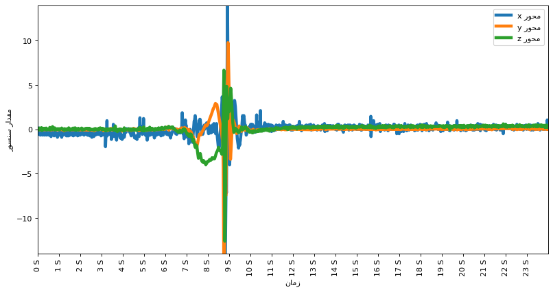
  </div>
  <div style="text-align: center;">
    <p>After Kalman Filter:</p>
    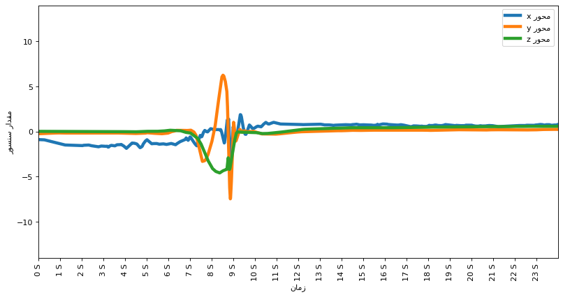
  </div>
</div>

#### Gyroscope Signals
<div style="display: flex; justify-content: space-around;">
  <div style="text-align: center;">
    <p>Before Kalman Filter:</p>
    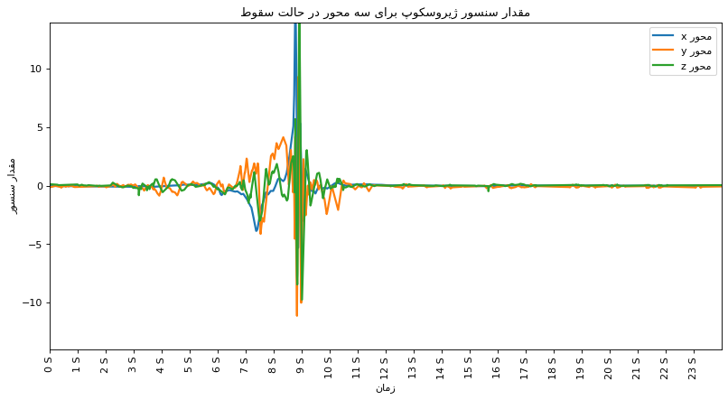
  </div>
  <div style="text-align: center;">
    <p>After Kalman Filter:</p>
    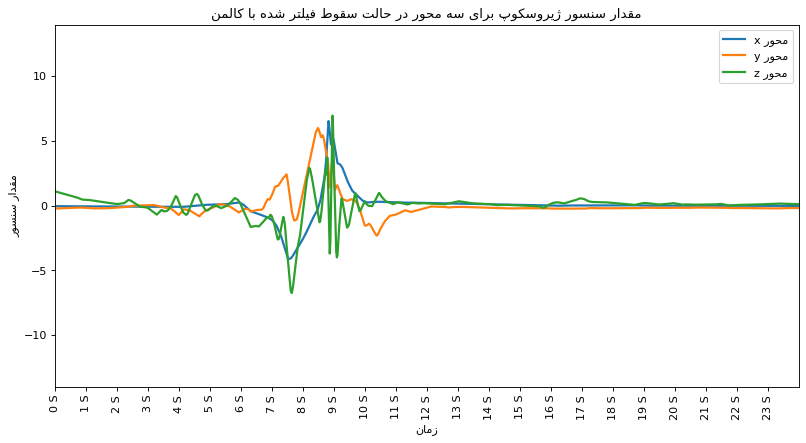
  </div>
</div>

#### Signal Magnitude Area (SMA) Comparison
<div style="display: flex; justify-content: space-around;">
  <div style="text-align: center;">
    <p>Accelerometer:</p>
    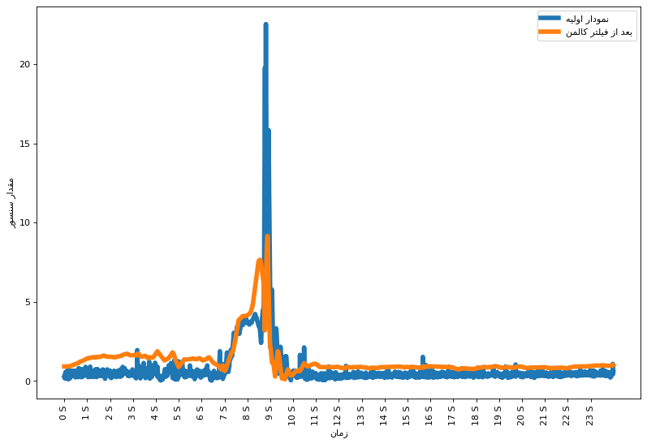
  </div>
  <div style="text-align: center;">
    <p>Gyroscope:</p>
    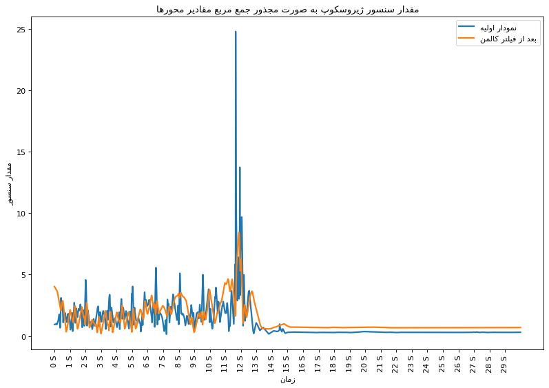
  </div>
</div>

### Data Analysis

#### Activity Frequency


#### State Frequency
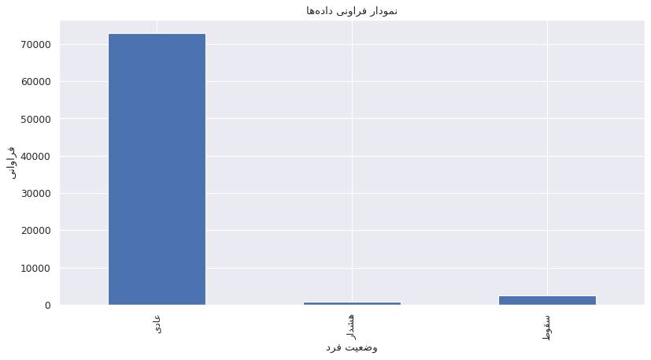

#### Distribution Standardization
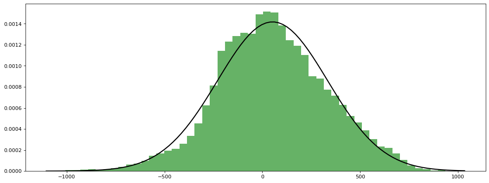

#### State Label Example
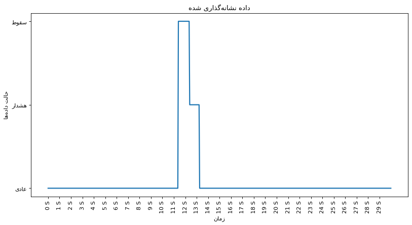

### Model and Performance

#### Deep Learning Model Architecture
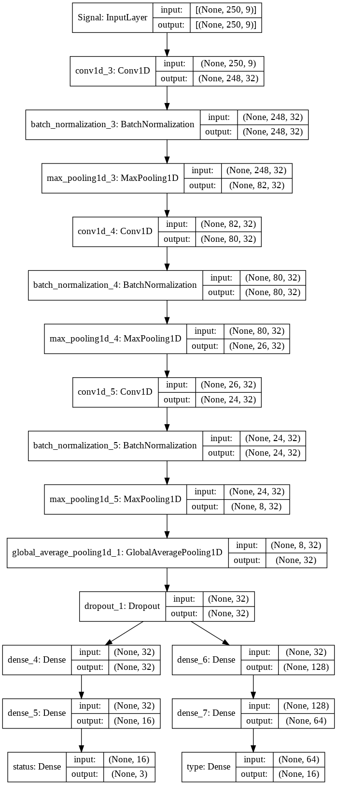

#### State Confusion Matrix
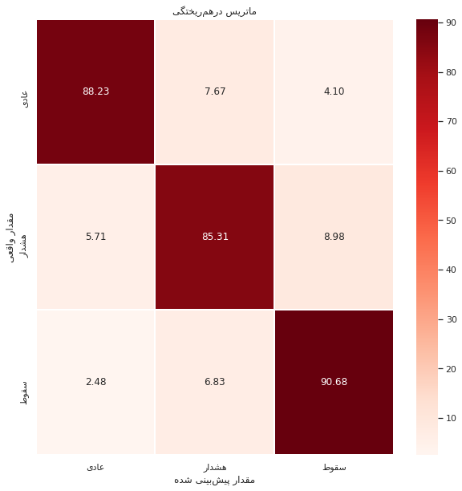

## Usage

Run the Jupyter notebooks to reproduce the results and visualizations shown above.

## Contributing

Feel free to submit issues or pull requests if you have suggestions for improvements or find any bugs.

## License

This project is licensed under the MIT License.
